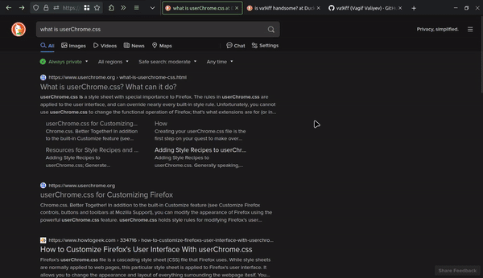

# Firefox url/tabs single row layout  
  
## The Reason - minimalism with adaptive focus
instead of having 2 thick rows, I'd like to have one. there's lot of empty space 
from the tabs and empty space for the url field. but urls can get very long, 
those extra space makes sense. what if there was a better way?  

make it short, and grow it when it's looked at. basically, it's wider when 
focused. I don't need to have long urls in front of my eyes all the time. when 
it's needed, I hit `alt+d` and it does the job. 

# Instructions _(How-to)_
### Setting `userChrome.css` file to write custom styles  
  1. click the menu (3-bar) button > Help > More Troubleshooting Information  
  2. find `Profile Directory` (you can use ctrl+f) and click `Open Directory` button next to it  
  3. from the opened location, go to `chrome` directory (create if doesn't exist)  
  4. create a file named `userChrome.css` and paste the styles from [`userChrome.css`](./userChrome.css) in that repo
  
### Enable loading custom style  
  1. type `about:config` into url bar and hit enter ("accept the risk" to continue)  
  2. type `toolkit.legacyUserProfileCustomizations.stylesheets` into "search preference name" field and toggle the matching one to be true  
  
### Restart Firefox - **DONE**  
now you should be able to enjoy that extra vertical 44px  

---  
  
#### additional steps:  
- Firefox themes are built to look good with the 2 row layout. they have color 
differences between tabs and urlbar. there's an extension to customize your 
theme, so you can pick the same color for your url and tabs bar.  
here's the link for [my gruvbox theme](https://color.firefox.com/?theme=XQAAAAIcAQAAAAAAAABBKYhm849SCia2CaaEGccwS-xMDPr23naIF863_287CelZc0d6IBKdWAiuXG9Z5Lzq5gyMHG8j2XzJbdPiNnGhrHrCXzsDVR22R2tTfl5tKvIU3nYr57p7mbgGcLzwPa9aIMO6w3tTtyYy1Aa1lGGW1qf_RQjT04ZZIFwsniBVqVa3zA44OqDiwniE68nRTfLZkRvmI0PlhyDQzRA_QH34h1MmwlG1sStZ1K6_GMvylkkowAB0e__c9UgA) in the screenshot  
- on your laptop, consider using your panel/start menu in vertical mode too :p
- if you need more space in navbar for your extensions, play with the variables to match the desired case
 
  
---  
  
in [`userChrome.css`](./userChrome.css), the properties `--navbar-width`, 
`--navbar-width-focused` and `--url-max-width-not-focused` are self explanatory. 
customize however you want. don't forget to restart firefox to see the changes.
